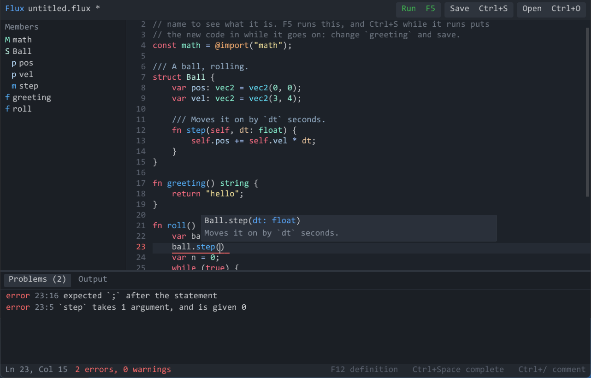
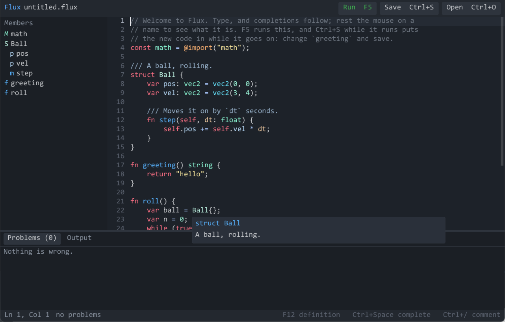

<p align="center">
  <picture>
    <source media="(prefers-color-scheme: dark)" srcset=".github/images/fluxion-logo-white.png">
    
  </picture>
</p>

<h1 align="center">Flux</h1>

<p align="center">
  <strong>A scripting language for games and applications, written in Zig.</strong><br>
  Zig and C to read, Python to write: typed where you say, checked where you do not, and reloaded while the program runs.
</p>

<p align="center">
  
  
  
  
  
</p>

<p align="center">
  <a href="#-the-language-at-a-glance">The language</a> ·
  <a href="#-errors-that-say-what-went-wrong">Errors</a> ·
  <a href="#-reloaded-while-it-runs">Reloading</a> ·
  <a href="#-in-an-editor">Editors</a> ·
  <a href="#-speed">Speed</a> ·
  <a href="#-in-a-program">Embedding</a> ·
  <a href="#-the-flux-command">The command</a> ·
  <a href="#-install">Install</a> ·
  <a href="#-what-comes-next">What comes next</a>
</p>

```zig
struct Enemy {
    @export var hp: int = 3;
    var pos: vec2 = vec2(0, 0);
    signal died(at: vec2);

    fn hit(self, damage: int) {
        self.hp -= damage;
        if (self.hp <= 0) self.died.emit(self.pos);
    }
}

fn waves() {
    for (1..=3) |wave| {
        print(f"wave {wave}: {wave * 4} enemies");
        spawn(wave * 4);
        await wait(2.0);              // the game goes on; this comes back in two seconds
    }
}

fn loadLevel(path: string) !Level {
    const text = try os.read_file(path);
    const data = json.parse(text) catch |e| return error.BadLevel(f"{path}: {e.message orelse e.name}");
    return Level.from(data);
}
```

| Piece | What it is |
| --- | --- |
| [The language](docs/language.md) | Braces and `fn` from Zig and C; lists, maps, closures and f-strings from Python; structs with signals, enums, `?T` and `!T`, tasks that `await`. |
| `flux` | The command: run a script, check it, test it, reload it as it is saved, show its bytecode, serve an editor. |
| `flux.Vm` | The virtual machine a Zig program embeds: compile, call, give scripts functions of its own, move their time on, reload them. |
| [`fluxion_script.h`](include/fluxion_script.h) | The same from C, with the static library `zig build` installs. |
| [Embedding](docs/embedding.md) | How a host uses all of it. |
| [Editors](docs/editors.md) | `flux lsp` for VS Code, Neovim, Helix and the rest; `flux.service` for an editor inside a program; a small IDE in [`examples/ide`](examples/ide). |

## ✨ What it is for

- 🎮 **Games.** Structs for things in the world, signals for what happens to them, `vec2` and `vec3` as plain values, tasks that `await` a timer or a signal, and a host that calls `update(dt)` each frame.
- 🧰 **Applications.** JSON, files, text, errors as values you handle - `try`, `catch`, `error.NotFound("why")` - and tests written next to the code.
- 🔎 **Typed where you say.** Give a type and the compiler checks it before the program starts; leave it out and the value is checked where it meets typed code. Typed code runs on typed instructions.
- 🩺 **Mistakes that say where and what.** Every error has the line, a caret, what was wanted and what was found, and often what to write. A runtime error comes with the stack of calls that led there.
- 🔥 **Reloaded while it runs.** Save a script and the game goes on with the new code: instances keep their identity and get new fields, variables keep their values.
- 💻 **Known to editors.** Completions, hovers with docs, signatures, go to definition and errors as you type, from the compiler itself - through `flux lsp`, or called in-process by an editor built into the program.
- ⚡ **Fast.** A register machine, typed instructions, inline caches, an incremental collector: level with Lua 5.4 - ahead on three of the benchmarks here, within 15% on the other three - and two to eight times ahead of Python.
- 🧯 **Kept in its place.** A budget of loop rounds, an interrupt from any thread, a memory ceiling; no files unless the host gives them.
- 🧩 **Small to embed.** One Zig module, or a static library and a header for C. No global state: as many VMs as you like.

## 📝 The language at a glance

```zig
const json = @import("json");

enum Mode { idle, chase, flee }

struct Wolf {
    var name: string = "wolf";
    var mode: Mode = .idle;
    var path: [vec2];                     // a new list for each wolf

    fn think(self, player: vec2, pos: vec2) {
        const d = pos.distance_to(player);
        self.mode = if (d < 20) .flee else if (d < 100) .chase else .idle;
    }
}

fn parsePort(text: string) !int {
    const n = try int(text);
    if (n < 1 or n > 65535) return error.OutOfRange(f"{n} is not a port");
    return n;
}

const port = parsePort("8080") catch 80;
const names = ["ada", "bob", "cid"].filter(|n| n != "bob").map(|n| n.upper());
var seen: [string: int] = {};
for (names) |n, i| seen[n] = i;
print(port, names, seen, json.stringify(Wolf{}));
```

Everything is in [the language reference](docs/language.md): values and
types, operators, control flow, functions and closures, structs and
`extends`, enums, `?T` and `!T`, lists and maps and strings, vectors and
colours, tasks, signals, modules, tests, and what is built in.

## 🩺 Errors that say what went wrong

```text
error: `Player` has no field or method `helth`
 --> game.flux:6:3
  |
6 | p.helth = 5;
  |   ^^^^^
  = help: did you mean `health`?

error: cannot use `+` on int and !int
 --> waves.flux:7:9
  |
7 |         spawned += int(spawn_rate(level));
  |         ^^^^^^^    ---------------------- this is !int
  = help: use it once its error is handled - `x catch 0` - or pass the error on with `try x`
```

One mistake is one message: a name that failed to resolve does not bring a
page of errors after it. `flux check --json` gives each as a line of JSON
for editors. At run time:

```text
error: index 5 is out of bounds for a list of length 1
 --> inventory.flux:5:16
  |
5 |         return self.items[slot];
  |                ^^^^^^^^^^^^^^^^
stack trace, most recent call first:
    in Inventory.take at inventory.flux:5:16
    in open at inventory.flux:10:12
    in <main> at inventory.flux:16:7
```

## 🔥 Reloaded while it runs

```bash
flux run --watch examples/scripts/arena.flux
```

Change the tower's damage in the file and save: the waves go on, and the
next shot hits harder. From a program, `vm.reload(module, new_source)` or
`flux_reload`. The new source is compiled over what the old one made, so
whatever holds those things goes on with the new code:

- instances keep their identity - a value the host holds is the same instance after - and get the struct's new fields, matched by name;
- functions and methods keep theirs, so a signal connected to one calls the new code;
- variables declared as before keep their values; top-level statements do not run again;
- a file that does not compile changes nothing, and says why; nor does one that breaks a file importing it.

When a struct's fields or a function's signature change, code from before
that is still running - a task mid-loop, an old lambda - cannot run on
safely; the reload stops it, with a warning at the line, instead of letting
it read the new layout wrongly. The rules are in
[embedding](docs/embedding.md#reloading-a-script-while-it-runs).

## 💻 In an editor

<p align="center">
  
</p>

The compiler runs over the file as it is typed, with a listener that
records what every name turned out to be, so an editor knows what the
compiler knows:

- **completions** - what is in scope, innermost first; after `x.` the fields and methods of `x`'s type - and of the host's values too, where the host says their type: `app.`, `self.entity.`; after `Enemy.` or `math.` what they declare; the enum's members after a `.` where one goes; the fields not yet given in `Enemy{ . }`;
- **hovers** with the declaration, its types resolved, and its `///` doc; **signature help** with the argument you are on;
- **go to definition** (F12, ctrl+click), **references**, an **outline**, **colours by meaning** - a field, a parameter, a signal - and **errors as you type**.

Code that does not parse yet still gets answers: the line being typed has
its brackets closed for the compiler, and a statement missing its `;` at the
end of a line is kept.

<table>
  <tr>
    <td></td>
    <td></td>
  </tr>
</table>

- **`flux lsp`** serves the Language Server Protocol. [`editors/vscode`](editors/vscode) is the VS Code extension; [editors](docs/editors.md) has Neovim, Helix, Sublime Text and Emacs.
- **`flux.service`** is the same as calls, for an editor inside a program - an engine's script editor.
- **`fluxion_script_code`** is Flux in [fluxion-code](https://github.com/kisstp2006/fluxion-code)'s editor: the language's words and rules, with the service behind them. fluxion-code does the rest - text, undo, keys, the view on fluxion-ui, finding and replacing - for any language. Flux's colours (`color(...)`, `hsv(...)`, `color("name")`) get a swatch and a picker, and a colour's name is offered in `color("`'s quotes. The Fluxion editor's code panel is one.
- **`zig build ide`** opens [`examples/ide`](examples/ide), a small IDE on [fluxion-ui](https://github.com/kisstp2006/fluxion-ui): a window around that editor, with the script's members, problems and output, F5 to run, and Ctrl+S while it runs to reload it.

Opening a 2,000-line file, compiling it and colouring it takes about 12 ms,
and a completion in it under 5; a 130-line file takes about a millisecond.

## ⚡ Speed

Best of three, in milliseconds, on an Intel i3-10100F under Windows 11;
Flux built with `-Doptimize=ReleaseFast`, Lua 5.4.4 with `-O2`, CPython
3.13. The programs are in [`bench/`](bench), and
[`bench/compare.sh`](bench/compare.sh) runs them.

| Program | What it does | Flux | Lua 5.4 | Python 3.13 |
| --- | --- | ---: | ---: | ---: |
| `fib` | recursive calls | 274 | **249** | 584 |
| `loop` | 50 million rounds of int arithmetic | 1037 | **964** | 8289 |
| `nbody` | float arithmetic on struct fields | **769** | 966 | 3128 |
| `trees` | binary trees made and walked: allocation | **1606** | 3981 | 4636 |
| `strings` | f-strings, map lookups, text | 158 | **138** | 408 |
| `particles` | `vec2` arithmetic over 10,000 structs | **366** | 518 | 2401 |

The Flux programs are written the way a script would be: `loop`'s
counter is a module variable, not a local. What makes the difference:

- **Typed instructions.** Where types are known, `a + b` on two ints is one instruction with no type test, and a struct's field is read by its position.
- **Registers, not a stack**, and compare-and-jump fused into one instruction.
- **Inline caches** for fields and methods reached through `any`.
- **Values that fit in sixteen bytes** - ints, floats, `vec2`, `vec3`, enum members - never touch the heap.
- **An incremental collector** that works a little at each allocation, so there is no long pause.

## 🔌 In a program

```zig
const flux = @import("fluxion_script");

const vm = try flux.Vm.create(gpa, .{ .out = out });
defer vm.destroy();

_ = try vm.defineModule("game", .{ .roll = roll, .version = 3 });   // Zig functions, converted by their signatures
var player: Player = .{};
const p = try vm.handle(&player);                                   // the real struct, seen through reflection

const module = vm.load("logic.flux", source) catch {
    try vm.writeDiagnostics(stderr, .{});
    return;
};
const update = vm.get(module, "update").?;
while (running) {
    if (vm.call(update, &.{ p, .float(dt) })) |_| {} else |_| {
        try vm.writePanic(stderr, .{});                             // the line, and every call
        vm.clearPanic();                                            // and the game goes on
    }
    try vm.update(dt);                                              // tasks that `await`ed wake
}
```

From C it is the same shape - `flux_vm_create`, `flux_define`, `flux_load`,
`flux_call`, `flux_update`, `flux_reload` - through
[`fluxion_script.h`](include/fluxion_script.h). Both hosts are in
[`examples/embed`](examples/embed): `zig build example-embed` and
`zig build example-embed-c`. [Embedding](docs/embedding.md) has the rest:
the host's own modules, reflection, time, panics, budgets, reloading.

## 🧰 The `flux` command

| Command | What it does |
| --- | --- |
| `flux run file.flux [args]` | compile and run; the arguments are `os.args`. Tasks run until none is waiting on the clock. |
| `flux run --watch file.flux` | run, and reload each file the script loaded when it is saved |
| `flux check file.flux` | compile only, and report; `--json` for editors |
| `flux test file.flux` | run the file's `test "..." { }` blocks |
| `flux disasm file.flux` | the bytecode each function compiles to |
| `flux ast file.flux` | the syntax tree |
| `flux lsp` | answer an editor over the Language Server Protocol, on standard input and output |

`--color` and `--no-color` choose; by default colour follows the terminal.
The exit code is 0, 1 for a file that does not compile, 2 for a panic, 3
for failed tests, 64 for a command line it did not understand.

## 📦 Install

```bash
zig fetch --save git+https://github.com/kisstp2006/fluxion-script
```

```zig
const flux = b.dependency("fluxion_script", .{ .target = target, .optimize = optimize });
exe_mod.addImport("fluxion_script", flux.module("fluxion_script"));
```

`zig build` makes the `flux` command, and the static library with its
header for C, in `zig-out`. `zig build test` runs the tests - each script
under [`tests/scripts`](tests/scripts) twice, once as it is and once with
the collector running on every allocation - and builds the examples. The
IDE's window packages are fetched only when this repository is the one
being built, never for a program that depends on it.

## 📁 What is where

| Folder | What is in it |
| --- | --- |
| [`src/syntax`](src/syntax) | the lexer, and a parser that goes on after a mistake to find the next |
| [`src/compile`](src/compile) | declarations gathered first, then one pass that checks types and makes code |
| [`src/vm`](src/vm) | the instruction loop, values, objects, the collector, tasks |
| [`src/lib`](src/lib) | what is built in: strings, lists, maps, vectors, signals, `math`, `json`, `os` |
| [`src/reload.zig`](src/reload.zig) | reloading, and [`src/reload`](src/reload) moving values to new layouts |
| [`src/api.zig`](src/api.zig), [`src/c.zig`](src/c.zig) | what a host calls, in Zig and in C |
| [`src/service`](src/service), [`src/lsp`](src/lsp) | what an editor asks - completions, hovers, colours - and the Language Server Protocol over it |
| [`src/code.zig`](src/code.zig) | Flux in fluxion-code's editor (`fluxion_script_code`) |
| [`examples`](examples) | scripts, a Zig and a C host, and [a small IDE](examples/ide) |
| [`editors`](editors) | the VS Code extension |
| [`tests`](tests) | scripts with what they print, the unit tests, and the C API's test |
| [`bench`](bench) | the programs the speed table comes from |
| [`docs`](docs) | the language reference, how to embed it, and editors |

## ✅ What is here, and what is not

- [x] The language as the reference describes it, with gradual types checked at compile time and at the edges of typed code
- [x] Tasks, `await`, timers and signals; errors as values; panics with stack traces
- [x] `math`, `json`, `os`, and modules of the host's own
- [x] Embedding from Zig and C; reflection of the host's structs; budgets, interrupts and a memory ceiling
- [x] Reloading while running, with instances moved to new layouts
- [x] What an engine asks of it: a struct's fields and annotations for an inspector, set and read by name; signals of the host's own, awaited like a script's; members the host supplies - in the Fluxion engine and its editor
- [x] The `flux` command, with `--watch` and JSON diagnostics
- [x] Tested on Windows and Linux (x86-64), and as WebAssembly under WASI: every test script prints the same on each. It builds for ARM Linux and macOS.
- [x] Broken sources by the thousand, from `zig build fuzz`: none crashes the compiler, the machine or an editor's questions about them
- [x] A language service and `flux lsp`: completion, hover, signatures, go to definition, references, outline, colours, errors as you type
- [x] A small IDE on fluxion-ui, and a VS Code extension
- [ ] A debugger: breakpoints, stepping, looking at variables
- [ ] A REPL, a formatter, and a tree-sitter grammar

## 🧭 What comes next

- **A debugger** through the VM's frames and the source spans every instruction keeps.
- **Faster calls**: calls are where Lua is still ahead.

## 🧱 Built on

| Package | For |
| --- | --- |
| [Fluxion Text](https://github.com/kisstp2006/fluxion-text) | reading source: positions, UTF-8, numbers, the "did you mean" |
| [Fluxion Hash](https://github.com/kisstp2006/fluxion-hash) | hashing strings |
| [Fluxion JSON](https://github.com/kisstp2006/fluxion-json) | the `json` module, and JSON diagnostics |
| [Fluxion Reflect](https://github.com/kisstp2006/fluxion-reflect) | the host's structs, read and written from scripts |
| [Fluxion UI](https://github.com/kisstp2006/fluxion-ui), [Platform](https://github.com/kisstp2006/fluxion-platform), [RHI](https://github.com/kisstp2006/fluxion-rhi), [Font](https://github.com/kisstp2006/fluxion-font) | the IDE example only: its layout, window, GPU and text |

## 📜 Licence

BSD-2-Clause: see [`LICENSE`](LICENSE). The packages it is built on have
their own, each in its repository.
